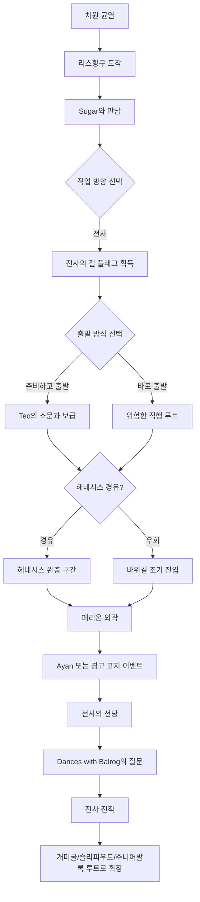

# 전사 루트 시나리오 초안

작성일: 2026-06-01  
대상 스토리팩: `victoria_island_adventurer_pack`  
범위: 리스항구 → 헤네시스 경유/우회 → 페리온 → 전사 전직 분기  
상태: 1차 기획 초안

## 1. 기획 의도

`victoria_island_adventurer_pack`는 현실 세계 또는 프렌즈 월드에서 온 평범한 인물이 빅토리아 아일랜드에 떨어지고, 모험가로 성장해 주니어발록을 마주한 뒤 원래 세계로 돌아갈지, 메이플 월드에 남을지를 선택하는 스토리팩이다.

이 문서는 그중 첫 번째 직업 루트인 **전사 루트**의 초반부를 정리한다.

전사 루트의 핵심은 단순히 강한 직업을 고르는 것이 아니다. 주인공이 메이플 월드의 규칙을 받아들이고, 위험한 길 앞에서 자기 의지로 한 걸음 앞으로 나서는 이야기다.

```text
낯섦 → 안정 → 결단 → 전직
```

장소별 역할은 다음과 같다.

```text
리스항구: 도착, 혼란, 직업 방향 선택
헤네시스: 숨 고르기, 보급, 초보자 감성 회복
페리온: 위험, 각오, 전사로서의 결단
전사의 전당: 질문, 인정, 전직
```

## 2. 기본 전제

아래 값은 아직 확정 전의 기본 추천안이다.

| 항목 | 기본 추천안 | 비고 |
|---|---|---|
| 주인공 출신 | 현실 세계 직장인 또는 프렌즈 월드 일반인 | 기존 `escape from the office`와 연결하려면 현실 직장인 추천 |
| 메이플 인지도 | 이름만 들어봤거나 어렴풋이 아는 정도 | 너무 고인물이면 메타 개그가 강해지고, 완전 무지하면 추억 감성이 약해짐 |
| 초반 목표 | 살아남기, 돌아갈 방법 찾기 | 겉으로는 전직, 실제로는 귀환 단서 탐색 |
| 중반 목표 | 전사가 되어 더 위험한 지역으로 갈 힘 얻기 | 전직은 생존 수단이자 정체성 선택 |
| 최종 목표 | 주니어발록 격파 후 귀환/정착 선택 | 발록은 차원문을 여는 문지기 역할 |
| 히든 루트 | 메이플 월드에 남아 후속 확장팩으로 이어짐 | 오르비스, 엘나스, 루디브리엄 등 후속팩 연결 가능 |

## 3. 전체 루트 개요



## 4. 주요 등장인물 역할

### 주인공

처음에는 자신이 게임 같은 세계에 들어왔다는 사실을 받아들이지 못한다. 하지만 리스항구에서 만나는 사람들, 몬스터와의 첫 전투, 헤네시스의 평온함, 페리온의 거친 공기를 지나며 점점 이 세계가 단순한 꿈이 아니라는 것을 인정한다.

전사 루트에서 주인공의 변화는 다음과 같다.

```text
도망치고 싶은 사람
↓
살아남기 위해 무기를 드는 사람
↓
누군가를 지키기 위해 앞에 서는 사람
↓
전사
```

### Sugar

리스항구에서 주인공에게 직업 방향을 묻는 안내자. 단순 튜토리얼 NPC가 아니라, 주인공이 처음으로 “이 세계에서 어떤 사람이 될 것인가”를 선택하게 만드는 인물로 사용한다.

예시 대사:

```text
Sugar:
“여긴 망설이는 사람보다, 결심한 사람이 더 오래 살아남아요.”
“전사로 갈 거라면 결국 바위 많은 마을까지 가게 될 거예요.”
```

### Teo

리스항구의 부두와 선원 소문을 담당하는 정보 허브. 페리온 쪽 길이 위험하다는 소문, 헤네시스를 들르면 보급을 받을 수 있다는 정보, 귀환 주문서의 존재 등을 알려준다.

예시 대사:

```text
Teo:
“선원들 말로는 바위 많은 마을 쪽 길이 요즘 영 심상치 않다더군.”
“그래도 가겠다면 준비는 하고 가. 이 섬은 친절하지만, 길은 친절하지 않아.”
```

### Bruce

헤네시스 경유 루트에서 정보를 주는 중간 허브. 페리온에 있는 Ayan과 연결되거나, 초보자들이 북쪽 바위길에서 다치는 이야기를 전해준다.

예시 대사:

```text
Bruce:
“페리온 쪽 소식이 거칠어졌어.”
“그냥 무턱대고 가지 말고, 누구를 만나 무엇을 들었는지는 꼭 기억해 둬.”
```

### Ayan

페리온 입구의 감정적 문지기. 플레이어에게 경고 표지를 읽게 만들고, 페리온이 겁 없는 사람이 아니라 겁을 알고도 들어오는 사람이 가는 곳이라는 메시지를 전달한다.

예시 대사:

```text
Ayan:
“초보자들은 늘 이 바위길을 만만하게 봐.”
“표지판을 읽고 가면 살아서 들어오고, 무시하면 들것으로 들어와.”
```

### Dances with Balrog

전사 전직의 최종 관문. 실력 체크보다 질문을 통해 주인공의 동기를 확인한다.

핵심 질문:

```text
“강해지고 싶다는 말은 누구나 한다.”
“그런데 무엇을 지키려고 강해지려는가?”
```

이 질문에 대한 플레이어의 선택이 이후 전사 성장 방향의 성향 플래그가 된다.

## 5. 챕터별 시나리오

### Chapter 0. 차원 균열

주인공은 현실의 사무실 또는 프렌즈 월드의 일상에서 잠깐 눈을 감았다가 낯선 파도 소리에 깨어난다.

```text
눈을 뜬다.
천장은 없다.
모니터도 없다.
대신 바다가 있다.

시스템 메시지 같은 글자가 눈앞에 흔들린다.

[리스항구]
```

목표:

```text
- 낯선 세계 도착
- 현실 감각 붕괴
- 리스항구를 첫 안전지대로 인식
```

### Chapter 1. 리스항구: 어디로 갈 건가요?

리스항구는 넓고 밝지만, 주인공에게는 모든 것이 한 박자 늦게 느껴진다. NPC들은 이 세계의 규칙을 당연하게 말하지만, 주인공은 그 말들이 게임 용어처럼 들린다.

주요 선택지:

```text
1) Sugar에게 직업에 대해 묻는다.
2) Teo에게 주변 소문을 듣는다.
3) 부두를 조사해 원래 세계로 돌아갈 단서를 찾는다.
4) 아무 준비 없이 길을 나선다.
```

결과 플래그 예시:

```text
warrior_route_intent
lith_harbor_sailor_rumor
return_gate_hint_01
reckless_departure
```

전사 루트 선택 시 Sugar가 페리온을 언급한다.

```text
Sugar:
“전사라면 페리온이에요.”
“바위와 먼지와 오래된 맹세가 있는 곳.”
```

### Chapter 2. 출발 전 준비

Teo는 페리온으로 가는 길이 위험하다고 경고한다. 플레이어는 준비하고 갈지, 바로 갈지 선택한다.

선택지:

```text
1) 달팽이 껍질 수집 일을 도와 보급을 얻는다.
2) 리스항구 주변에서 전투 감각을 익힌다.
3) 귀환 주문서를 산다.
4) 바로 출발한다.
```

보상 예시:

```text
Red Potion x3
Return Scroll to Lith Harbor x1
beginner_weapon_preference 선택 가능
```

무기 성향 선택:

```text
검: 균형형, Fighter/Page 어느 쪽으로도 자연스럽게 이어짐
도끼: 공격형, Fighter 성향 암시
창: 사거리/돌파형, Spearman 성향 암시
```

### Chapter 3. 헤네시스 경유 또는 우회

리스항구에서 페리온으로 곧장 갈 수도 있지만, 헤네시스를 들르면 완충 구간이 열린다.

#### 헤네시스 경유 루트

헤네시스는 밝고 평화로운 초보자 감성 구간이다. 주황버섯, 리본돼지, 초록버섯 같은 몬스터가 등장하지만, 페리온에 비하면 상대적으로 숨을 고를 수 있다.

주요 기능:

```text
- 보급 획득
- 초반 전투 튜토리얼
- 주황버섯 동료 이벤트 가능
- Bruce를 통한 페리온 경고 정보 획득
```

주황버섯 동료 이벤트 예시:

```text
쓰러뜨렸다고 생각한 주황버섯이 멀찍이서 따라온다.
도망치는 것도 아니고, 덤비는 것도 아니다.

선택:
1) 먹을 것을 조금 나눠준다.
2) 그냥 둔다.
3) 쫓아낸다.
```

플래그:

```text
ally_orange_mushroom
```

#### 우회/직행 루트

헤네시스를 생략하면 템포는 빠르지만 페리온 외곽에서 더 큰 위험을 감수한다.

주요 효과:

```text
- 빠른 페리온 진입
- 보급 부족
- reckless_departure 플래그가 특정 대사/전투에 반영
- Ayan에게 무모하다는 지적을 받음
```

### Chapter 4. 페리온 외곽: 경고 표지

페리온 입구는 리스항구와 헤네시스의 수평적이고 밝은 이미지와 달리 수직적이고 건조하다. 바람, 모래, 바위, 경고 표지가 주요 이미지다.

대표 장면:

```text
[페리온 입구]

바람이 모래를 밀어 올리고,
표지판은 찢긴 채로도 읽힌다.

'초보자들은 북쪽 바위길을 얕보지 말 것.'
```

선택지:

```text
1) 경고 표지를 자세히 읽는다.
2) 바로 바위길로 들어간다.
3) Ayan에게 전사의 전당 위치를 묻는다.
4) 귀환 주문서를 만지작거린다.
```

결과 예시:

```text
read_perion_warning_sign
ignored_perion_warning
ayan_respect_or_warning
```

Ayan 대사 예시:

```text
Ayan:
“여긴 겁이 없는 사람이 오는 곳이 아니야.”
“겁이 있어도 들어오는 사람이 오는 곳이지.”
```

### Chapter 5. 바위길 전투

페리온 외곽에서는 전사다운 전투 문법을 학습한다.

전투 핵심:

```text
Power Strike: 단일 강타
Slash Blast: 근접 다중 타격
Guard/Iron Body 감각: 피해를 줄이며 버티기
Potion: 무리한 돌파를 가능하게 하는 안전장치
Return Scroll: 패배가 아니라 재정비 수단
```

예시 인카운터:

```text
[바위길 돌진]

바위벽 사이에서 멧돼지 울음이 메아리친다.
발밑 자갈이 먼저 흔들리고,
다음 순간 그림자 둘이 튀어나온다.

선택:
1) 파워 스트라이크로 선두를 끊는다.
2) 슬래시 블래스트로 붙은 둘을 함께 밀어낸다.
3) 방어 자세를 취해 돌진을 흘린다.
4) 귀환 주문서로 후퇴한다.
5) 주황버섯의 신호를 믿고 옆으로 빠진다. [ally_orange_mushroom 필요]
```

이 전투는 플레이어에게 전사 루트의 정체성을 각인한다.

```text
도망치지 않는다.
하지만 무모하게 맞기만 하지도 않는다.
앞에 서서, 버티고, 밀어낸다.
```

### Chapter 6. 전사의 전당

페리온의 가장 높은 곳, 또는 가장 거친 바위길 끝에 전사의 전당이 있다.

Dances with Balrog는 주인공의 힘보다 이유를 먼저 묻는다.

```text
Dances with Balrog:
“강해지고 싶다는 말은 누구나 한다.”
“무엇을 지키려고 강해지려는가?”
```

플레이어 답변 선택지:

```text
1) 원래 세계로 돌아가기 위해.
2) 살아남기 위해.
3) 나를 도와준 사람들을 지키기 위해.
4) 아직 모르지만, 도망치고 싶지는 않아서.
```

성향 플래그:

```text
warrior_motive_return
warrior_motive_survival
warrior_motive_protection
warrior_motive_resolve
```

전직 연출:

```text
당신은 검자루를 쥔다.
손바닥의 떨림이 멈추지는 않는다.

하지만 이제 떨림 때문에 물러나지는 않는다.

[전직 완료]
전사
```

## 6. 전사 루트의 이후 연결

전직 이후 루트는 다음처럼 이어진다.

```text
전사 전직
↓
페리온 주변 사냥/수련
↓
개미굴 진입 준비
↓
슬리피우드/개미굴
↓
주니어발록의 소문
↓
주니어발록 격파
↓
차원문 개방
↓
귀환 엔딩 또는 정착 히든 엔딩
```

주니어발록의 역할은 단순 보스보다 **차원문을 지키는 문지기**로 설정하는 것이 좋다.

```text
주니어발록 격파
↓
검은 날개가 사라진 자리에 균열이 열린다.
↓
돌아갈 수 있다.
하지만 남을 수도 있다.
```

## 7. 엔딩 방향

### 기본 엔딩: 귀환

```text
[차원 균열]

집으로 돌아갈 수 있습니다.

선택:
1) 돌아간다.
2) 남는다. [히든 조건 필요]
```

귀환 엔딩 예시:

```text
눈을 뜬다.
회사 책상.
모니터에는 메일 3통이 와 있다.

오전 8:42

손바닥에는 아직 검자루를 쥐었던 감각이 남아 있다.
```

### 히든 엔딩: 정착

```text
당신은 균열을 지나지 않았다.
발걸음을 돌린다.

[모험가 길드]

누군가 묻는다.
“정말 남겠다는 건가?”

당신은 대답하지 않았다.
하지만 이미 알고 있었다.

돌아가지 않을 것이라는 걸.
```

히든 엔딩명:

```text
END: 새로운 시작
```

후속 확장팩 연결:

```text
정착 엔딩 달성
↓
오르비스 / 엘나스 / 루디브리엄 등 후속 스토리팩 해금
```

## 8. 시스템 요구사항 초안

전사 루트를 구현하기 위해 필요한 최소 시스템은 다음과 같다.

| 시스템 | 최소 구현 | 비고 |
|---|---|---|
| 레벨/경험치 | `level`, `exp`, `exp_to_next` | 메이플 감성 핵심 |
| 직업 상태 | `job_tier`, `job_name` | beginner → warrior |
| 무기 성향 | `weapon_style` | sword / axe / spear |
| 전투 선택지 | 단일 강타, 광역, 방어, 회복, 후퇴 | encounter-driven 전투로 충분 |
| 동료 | 플래그 기반 | `ally_orange_mushroom` 같은 선택지 개방 방식 |
| 귀환 주문서 | 아이템 기반 후퇴 | 패배 대신 재정비 수단 |
| 성향 플래그 | 전직 질문 답변 기반 | 후속 루트 분기용 |

기존 `tui_adv` 코어가 이미 선택지 조건, 비용, 결과, 플래그, 아이템, 인카운터를 지원한다면, 첫 MVP는 레벨/EXP와 직업 관련 상태만 최소 확장해도 가능하다.

## 9. 인터뷰 질문 목록

다음 질문에 대한 답변이 나오면 이 문서를 확정안으로 업데이트한다.

### 주인공 설정

1. 주인공은 현실 세계 직장인인가, 프렌즈 월드 일반인인가?
2. 주인공은 메이플스토리를 얼마나 알고 있는가?
3. 주인공의 기본 성격은 겁 많음, 평범함, 호전적, 냉소적 중 어디에 가까운가?
4. 주인공은 원래 세계로 돌아가고 싶은 마음이 강한가, 아니면 새 세계에 끌리는가?

### 전사 루트 감정선

1. 리스항구는 “설렘”에 가까워야 하는가, “불안”에 가까워야 하는가?
2. 헤네시스는 필수 경유지로 둘 것인가, 선택 경유지로 둘 것인가?
3. 페리온은 무섭고 거친 곳으로 갈 것인가, 전사들의 성지처럼 장엄하게 갈 것인가?
4. 전사가 되는 핵심 감정은 생존, 책임, 용기, 귀환 중 무엇인가?

### 전투와 성장

1. 전투는 자동에 가깝게 할 것인가, 선택지 개입을 자주 넣을 것인가?
2. Power Strike / Slash Blast 같은 원작 스킬명을 그대로 사용할 것인가?
3. 검/도끼/창 선택을 실제 성능 차이로 둘 것인가, 성향 플래그로만 둘 것인가?
4. 초반 전투 난이도는 추억형으로 쉽게 갈 것인가, 생존형으로 빡빡하게 갈 것인가?

### NPC와 동료

1. Sugar, Teo, Bruce, Ayan, Dances with Balrog를 모두 사용할 것인가?
2. 주황버섯 동료는 귀여운 보조인가, 실제 전투 선택지를 바꾸는 장치인가?
3. 원작 NPC 말투를 최대한 살릴 것인가, 이세계 주인공과의 대비를 위해 새로 해석할 것인가?

### 최종 연결

1. 주니어발록은 단순 보스인가, 차원문 문지기인가?
2. 귀환 엔딩과 정착 히든 엔딩 중 어느 쪽을 정사로 둘 것인가?
3. 정착 히든 엔딩을 후속 확장팩 해금 조건으로 둘 것인가?

## 10. 참고 기준

- 메이플스토리 공식 직업소개: 히어로, 팔라딘, 다크나이트, 키네시스
- 메이플스토리 공식 음악 페이지: 리스항구, 헤네시스, 페리온 등 마을 정서 참고
- 코믹 메이플스토리 오프라인 RPG 관련 공개 설정: 도도, 에아, 아루루, 바우, 주카, 델리키의 카메오 방향 참고

## 11. 다음 작업

```text
1. 인터뷰 질문에 답해 설정 확정
2. locations 초안 작성: Lith Harbor / Henesys / Perion / Perion Outer Road / Warriors' Sanctuary
3. encounters 초안 작성: snail_training / mushroom_field / perion_boar_charge / warrior_trial
4. items 초안 작성: Red Potion / Blue Potion / Return Scroll / beginner weapons
5. endings 초안 작성: return_to_real_world / stay_in_maple_world_hidden
6. 레벨/EXP 상태 확장 필요 여부 확인
```

이 문서는 구현 전에 전체 톤을 고정하기 위한 기준 문서다. 이후 YAML 콘텐츠로 내려갈 때는 여기의 챕터와 플래그 이름을 가능한 한 유지한다.
